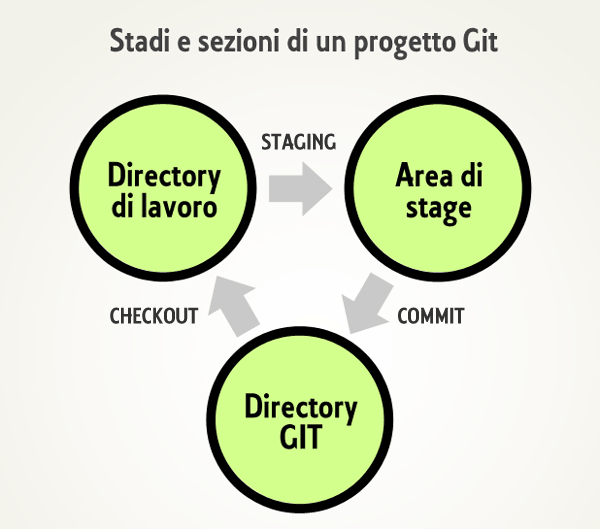

<style>
    .reveal h1 {
        font-size: 2em;
    }

    .reveal li {
        font-size: 0.8em;
    }

    .reveal code {
        background-color: #000000;
        color: #ffffff;
    }

    .language-bash {
        background-color: #000000;
        color: #00ff00;
    }
</style>

# CONTROLLO DI VERSIONE CON `GIT`

---

# PROGETTO SOFTWARE

-   costituito da numerosi files (centinaia, a volte migliaia) che cambiano nel tempo {: .fragment}
-   creato, gestito, modificato da uno o spesso molti sviluppatori {: .fragment}

---

# SISTEMA DI VERSIONAMENTO

-   consente di tenere sotto controllo i cambiamenti di un software nel suo complesso e nelle sue parti costitutive {: .fragment}

-   permette di gestire l'accesso al progetto (autenticazione, privilegi, permessi di scrittura) {: .fragment}

---

# GIT
-   Creato da Linus Torvalds, lo stesso del kernel Linux {: .fragment}
-   Modello `DISTRIBUITO` {: .fragment}
-   Gestione dei dati a `ISTANTANEA` {: .fragment}

---

# DISTRIBUITO

-   Ogni sviluppatore ha una copia locale dell'intero `REPOSITORY`, che contiene tutti i files del progetto, tutte le modifiche e l'`albero delle relazioni` {: .fragment}

-   La maggior parte delle operazioni avvengono nella copia locale del repository {: .fragment}


---

# MODELLO A ISTANTANEA

-   Genera delle `istantanee` (_snapshot_) di tutti i file in un determinato momento {: .fragment}
-   Gli altri sistemi salvano le modifiche ai file (Modello incrementale, o _a base delta_) {: .fragment}

--

## Modello incrementale


--

## Modello a *istantanea*


---

# STATI DI UN FILE

-   **Modificato**: il file ha subito dei cambiamenti, ma non è ancora stato _registrato_ {: .fragment}
-   **In stage**: il file, modificato, viene aggiunto aggiunto allo stage, quindi preparato per essere aggiunto alla prossima _istantanea_ {: .fragment}
-   **Committato**: il file (insieme agli altri presenti nell'area di stage) viene salvato nel repository (database) locale. Viene di fatto salvata una nuova versione (locale) del progetto {: .fragment}


---

# AREE DI UN PROGETTO GIT

-   **Directory di lavoro (_working dir_)**: contiene una determinata versione del progetto (scelta attraverso un _checkout_), ossia una certa istantanea dei file su cui vogliamo lavorare {: .fragment}
-   **Directory di git (_git dir_)**: database che contiene tutti i dati e i metadati del progetto (storico delle versioni). Di fatto contiene tutti i *commit* {: .fragment}
-   **Area di stage (_staging area_)**: chiamata Indice (_Index_), contiene le informazioni relative ai cambiamenti dei file che verranno inviati al database per creare una nuova versione {: .fragment}

--



---

# INSTALLAZIONE

[https://git-scm.com/](https://git-scm.com/)


---

# CONFIGURAZIONE MINIMA

```bash
git config --global user.name pippo
git config --global user.email pippo@example.com
git config --global core.editor vim
```


---

# COMANDI ESSENZIALI

-   `git init`: crea un nuovo repository locale
-   `git add`: aggiunge uno o più files all'area di staging
-   `git commit`: salva nella directory **.git** tutto quello che si trova nell'area di staging, creando di fatto una nuova **istantanea** (versione) del progetto
-   `git status`: mostra lo stato dell'area di lavoro


---

# ESERCITAZIONE 1

1. Creare un nuovo repository chiamato `esercitazione_1`
1. Creare un file di testo chiamato `README` e scrivere qualcosa al suo interno
1. Aggiungere il file all'area di staging
1. Eseguire il commit


---

# SVOLGIMENTO

```bash
mkdir esercitazione_1
cd esercitazione_1
git init
echo -e "ciao" >> README
git add README
git status
git commit -m "il mio primo commit"
git status
```


---

# REPOSITORY REMOTI SU `GITHUB`

-   Creare un account su [github.com](github.com)
-   Creare un repository su github
-   Clonare un repository in locale con `git clone`
-   Invitare collaboratori


---

# COMANDI PRINCIPALI

-   `git push`: invia al repository remoto i commit creati sul repository locale
-   `git pull`: scarica nel repository locale i nuovi commit presenti sul repository remoto